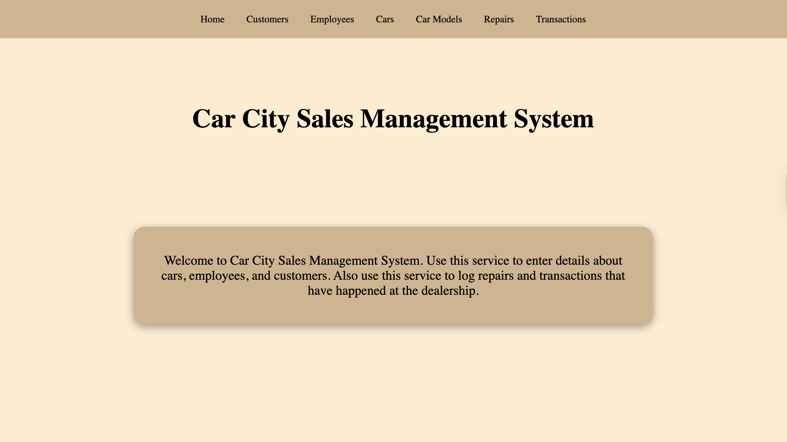
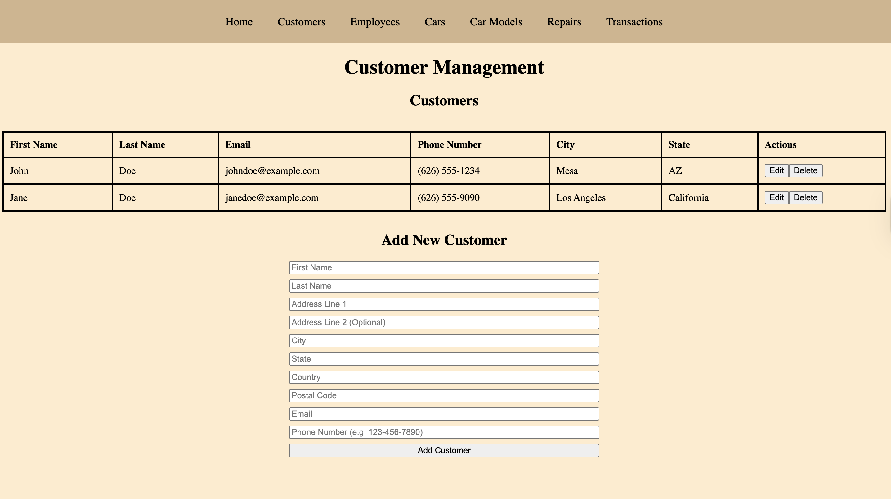
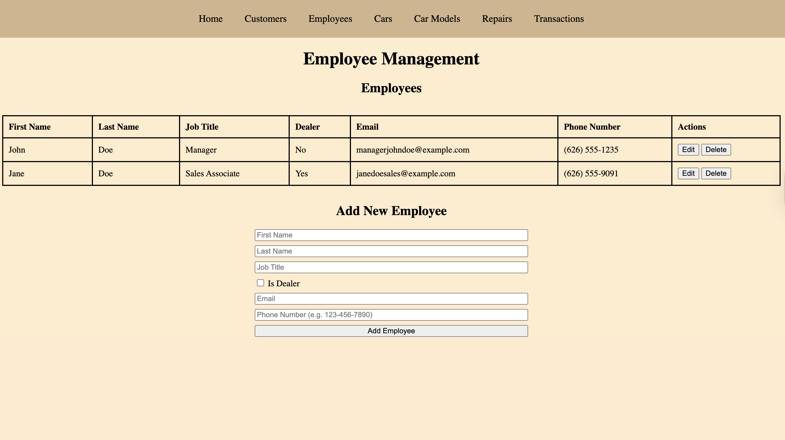
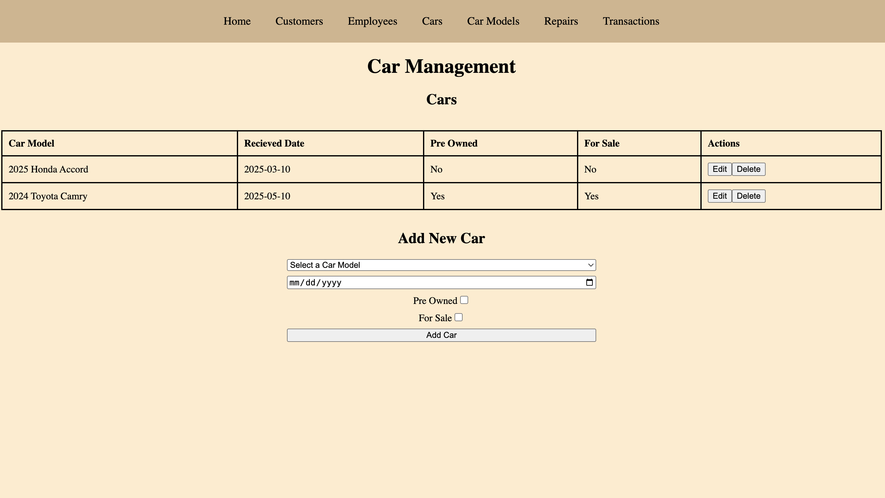
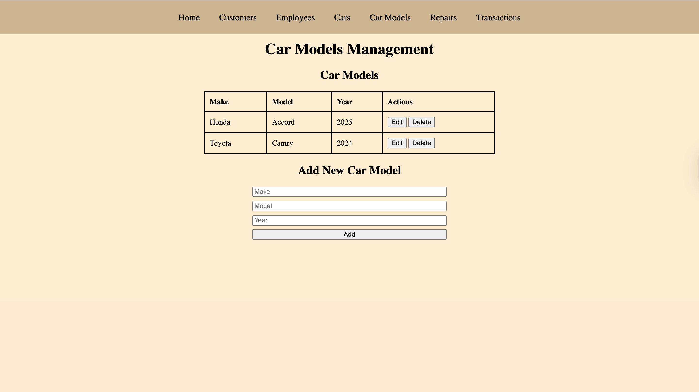
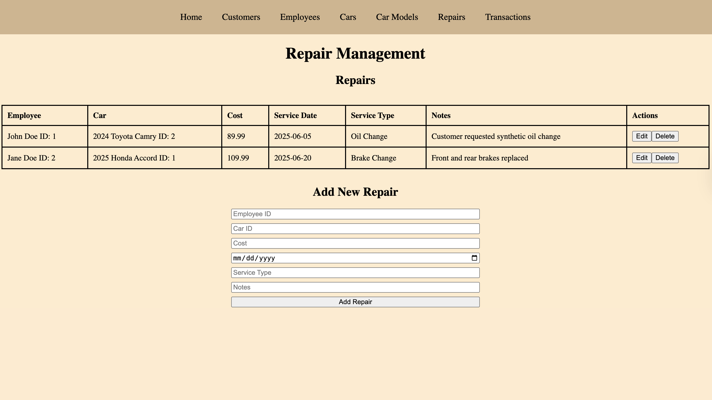
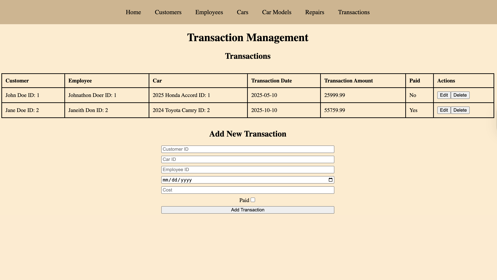

# Car City Sales Management System

## Table of contents

* [Overview](#overview)
* [User Guide](#user-guide)
* [Landing Page](#landing-page)
* [Customers Page](#customerscustomer-management-page)
* [Employees Page](#employeesemployee-management-page)
* [Cars Page](#carscar-management-page)
* [Car Models Page](#car-modelscar-models-management-page)
* [Repairs Page](#repairrepairs-management-page)
* [Transactions Page](#transactionstransaction-management-page)

## Overview

Car City Sales Management System is an application designed for the fictional dealership Car City. It enables efficient management of customers, employees, vehicles, repairs, and transactions. The system provides full functionality to add, edit, and delete records, ensuring the dealership can seamlessly track and organize every aspect of its operations.

### Key Features

* Manage customers, employees, vehicles, repairs, and transactions in one system.
* Add, edit, and delete records to keep information accurate and up to date.
* Track car sales and service history for better customer support.
* Maintain organized employee and customer databases.
* Streamline dealership operations by connecting sales, service, and management functions.

### Purpose

Car City Sales Management System was created to simulate how a dealership manages its day-to-day operations. The application provides tools to organize records, track important business activities, and ensure smooth communication between departments. By integrating sales, repairs, and personnel management, Car City is able to operate more efficiently and provide better service to customers.

## User Guide

This section provides an overview of Car City Sales Management System's main features and how dealership staff and admin can interact with the system.

### Landing Page

The landing page displays the application's name and purpose.

### Customers/Customer Management Page

The Customer Management page allows Car City staff to view, add, edit, and delete customer records to keep information accurate and up to date. Each customer entry includes:
- First and last name
- City, state, and optional address details
- Email address
- Phone number
- Actions for editing or deleting the customer’s information

At the bottom of the page, staff can use the Add New Customer form to enter complete details for a new customer, ensuring all relevant contact and location information is recorded in the system.

### Employees/Employee Management Page

The Employee Management page allows Car City admin to view, add, edit, and delete employee records to keep information accurate and up to date. Each employee entry includes:
- First and last name
- Job title
- Checkbox for Is Dealer (to indicate if the employee works as a car dealer on the sales floor)
- Phone number
- Actions for editing or deleting the employee’s information

At the bottom of the page, dealership admin can use the Add New Employee form to enter complete details for a new employee, ensuring all relevant contact and job title information is recorded in the system.

### Car/Cars Management Page

The Car Management page allows Car City staff to organize and track the dealership’s inventory of vehicles. Each car entry includes:
- Car model
- Data received
- Whether the vehicle is pre-owned or new
- Whether the vehicle is currently for sale
- Actions for editing or deleting car information

At the bottom of the page, staff can use the Add New Car form to register a vehicle into the system. The form includes options to select the model, enter the received date, and mark if the car is pre-owned or available for sale.

### Car Models/Car Models Management Page

The Car Models Management page allows Car City staff to organize and track the dealership’s inventory of various car makes and models. Each car model entry includes:
- Car make
- Car model
- Car model year
- Actions for editing or deleting repair information

At the bottom of the page, staff can use the Add New Car Model form to register a car make into the system. The form includes options to select the make, model, and year of the car. 

### Repair/Repairs Management Page

The Repair Management page allows Car City staff to record and track vehicle service history. Each repair entry includes:
- Employee responsible for the repair (with ID reference)
- Car being serviced (with ID reference)
- Repair cost
- Service date
- Service type (e.g., oil change, brake replacement)
- Notes with additional details about the repair
- Actions for editing or deleting repair information

At the bottom of the page, staff can use the Add New Repair form to log new service details. The form requires the employee ID, car ID, cost, service date, service type, and optional notes to provide a complete service record for each vehicle.

## Transactions/Transaction Management Page

The Transaction Management page allows Car City staff to track vehicle sales and related financial records. Each transaction entry includes:
- Customer associated with the purchase (with ID reference)
- Employee handling the transaction (with ID reference)
- Car involved in the transaction (with ID reference)
- Transaction date
- Transaction amount
- Payment status (whether the purchase has been paid)
- Actions for editing or deleting transaction details

At the bottom of the page, staff can use the Add New Transaction form to record a new sale. The form requires a customer ID, car ID, employee ID, date, cost, and payment status to ensure accurate financial tracking and sales reporting.

